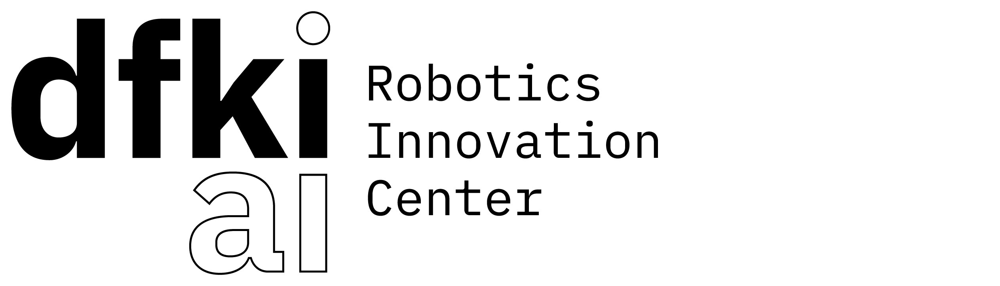
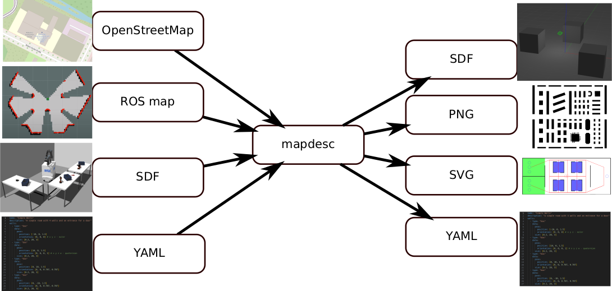

# mapdesc

**Map Desc**ription System for Robotics - generate and exports walls and other static objects from different sources to import into robotic simulations or as base for autonomous navigation. Can generate environments for navigation simulations (e.g. navsim-2d or Gazebo) from a given image as map using OpenCV or a map from a web-based editor. The map can also be exported into an image or YAML as input for the editor.

MapDesc was initiated and is currently developed at the [Robotics Innovation Center](http://robotik.dfki-bremen.de/en/startpage.html) of the [German Research Center for Artificial Intelligence (DFKI)](http://www.dfki.de) in Bremen.




## Motivation
MapDesc allows you to import your data from different sources and export them into other formats

### Inputs
<!-- 
- SDF-files (WIP)
- IFC / IFCXML -files (WIP)
- Floor plans (WIP)
-->
- OpenStreetMap (using OSMPythonTooly, you provide coordinates of a center point and a radius around it)
- ROS map (YAML and image file that is used by the [ROS map server](http://wiki.ros.org/map_server))
- SDF-file environment description for gazebo (only parses collision box or mesh, ignores visual representation)
- YAML-description of walls, for example created by the [Map-Editor](../map-editor) (see format description)

### Outputs
- SDF-files for gazebo simulation
- PNG-file (can be used as debug or to generate a PNG-file for the ROS map)
- SVG-file (can be used as debug to see the obstacle as individual objects)
- YAML-description of walls (see format description) that can be uploaded to the [Map-Editor](../map-editor)
<!--
- 2D-map (image) for [nav 2](https://navigation.ros.org) or [move_base](http://wiki.ros.org/move_base) (WIP)
- 3D-model
-->



## Installation
**mapdesc** is written in python, so it can be installed for the current user using pip/pip3:

```bash
# clone and cd into the mapdesc-directory
pip3 install .
```

### Dependencies
OpenCV2 is used for extracting and saving information from images.

For Linux Ubuntu there are python-packages available:
```bash
sudo apt install python3-opencv
```

And for Linux Fedora:
```bash
sudo dnf install python3-opencv opencv
```

we also depend on these libraries:
- **pyyaml** to parse YAML-files like map descriptions and metadata.
- **jinja2** to generate SDF-files.
- **imutils** to get contours of an image when it gets loaded.
- **argcomplete** to autocomplete command-line arguments.

## Getting Started
### Usage
see `mapdesc -h`

Examples:

```bash
# export rosmap yaml file and image to our own yaml-based format using opencv2
mapdesc rosmap test/map/mallmap.yaml yaml test2.yml
# export a yaml-based description to an SDF file using jinja2
mapdesc yaml test/yaml/simple_walls.yaml sdf test.sdf
```

### Troubleshooting
If you try to call `mapdesc` from your command line and you get the error message

`mapdesc: command not found`

you need to add your local bin-folder to your path, so just add

`export PATH=~/.local/bin:$PATH`

to your local `.bashrc` and source it again (`source ~/.bashrc`).

## Format description

The format is loosely based on the [SDFormat](http://sdformat.org/) geometry description to describe worlds in the robotic simulation [Gazebo](https://gazebosim.org/). See [SDF specification](http://sdformat.org/spec) for details.

The format of the lanes-graph is loosely based on the ROS-messages for OpenRMF, see [RMF building map msgs](https://github.com/open-rmf/rmf_building_map_msgs/) for details.

## Testing

### Robotics / Gazebo
To test the generated SDF files with gazebo you can start gazebo with the SDF-folder as `GAZEBO_MODEL_PATH` variable, for example like this: `GAZEBO_MODEL_PATH=/home/user/mapdesc/generated/sdf/ gazebo` after you run the "`test_cli.bash`" file and the SDF-file you want to load is inside the generated-folder.

Please check the unit tests [here](/test/).

## Contributing

Please use the [issue tracker](map_desc/issues) to submit bug reports and feature requests. Please use merge requests as described [here](/CONTRIBUTING.md) to add/adapt functionality. 

## License

MapDesc is distributed under the [3-clause BSD license](https://opensource.org/licenses/BSD-3-Clause).

## Maintainer / Authors / Contributers

Andreas Bresser, andreas.bresser@dfki.de

Copyright 2023, DFKI GmbH / Robotics Innovation Center
