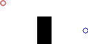
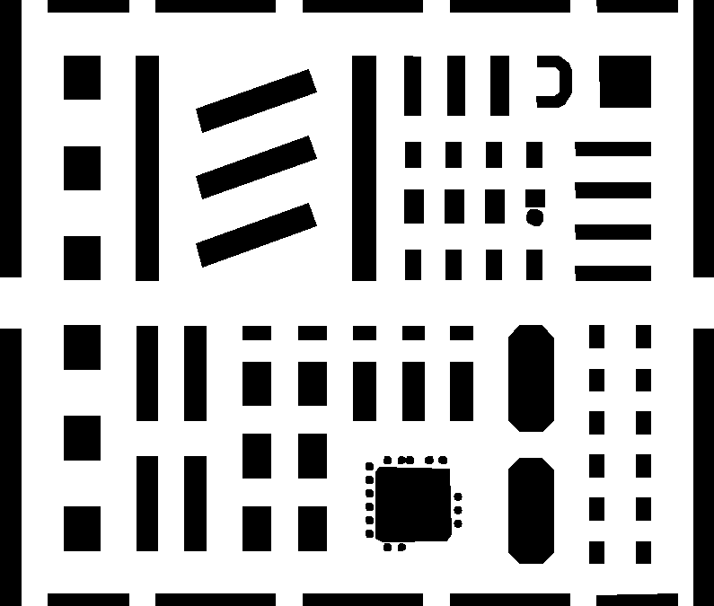

# Examples

1. Creating a map
2. Import and export data

## Creating a map:

For the beginning we will generate a simple map with two objects as `Marker` and an obstacle `Wall`. Let’s take a look at the mapdesc folder, for now the model and save folder are relevant.


`model` – contains the modules to describe the map, includes basic geometric descriptions for obstacles (for example box, cylinder) as well as their position and orientation (for example pose, vector2, quaternion...)
`save` – contains the modules to generate image files etc. from the model objects

1. Import the required libraries:

    ```python
    from mapdesc.model import Map, Marker, Wall
    from mapdesc.model.geom import Pose, Vector3, Box, Dimenstion
    from mapdesc import save
    ```

2. Define what should be on the map, in this case 2 Marker named 'storage' and 'production' and a Wall named 'wall'. The map size is variable and will be set according to the position and dimensions of the outer objects.

    ```python
    storage = Marker(
        name = 'storage', 
        radius = 0.2,
        pose = Pose(
            position = Vector3(0,3,0)
        ),
        color = [255,0,0]
    )

    production = Marker(
        name = 'production', 
        radius = 0.2,
        pose = Pose(
            position = Vector3(6,5,0)
        ),
        color = [0,0,255]
    )
    wall = Wall(data = Box(
            pose = Pose(
                position = Vector3(3,5,0)
            ),
            size = Dimension(1.0,2.0,1.0)
        )
    )
    ```
3. Now we can generate the map that will contain the marker and the wall.

    ```python
    world = Map(
        name='world',
        marker=[
            storage, production
        ],
        wall=[wall] 
    )
    ```

4. Almost done! In order to have an output we need to call the desired function from the save module. For example to export the whole map into a .png image. 
    ```python
    save.save_png(world, 'world.png')
    ```

5. The result will be saved as world.png below the folder where you run your code. It should look like this:  



## Import and export data
In this example we will import a map recorded using the [ROS map_server](http://wiki.ros.org/map_server) and export it to an image file.
1. Import the required libraries:
    ```python
    from mapdesc.load.rosmap import load_rosmap  
    from mapdesc.save import save_png
    ```
2. Use the specific function to import the .yaml file
    ```python
    testmap = load_rosmap('./test/map/mallmap.yaml')
    ```

3. Export it to .png.
    ```python
    save_png(testmap, './mallmap.png')
    ```
4. The output should like:

    

5. Be aware that the exported file may look slightly different to the imported one. Due to the fact that the import file is converted into its abstracted structure and then reconstructed to a file, so that some pixel information will not be identical, especially for circles or rotated objects we loose information.